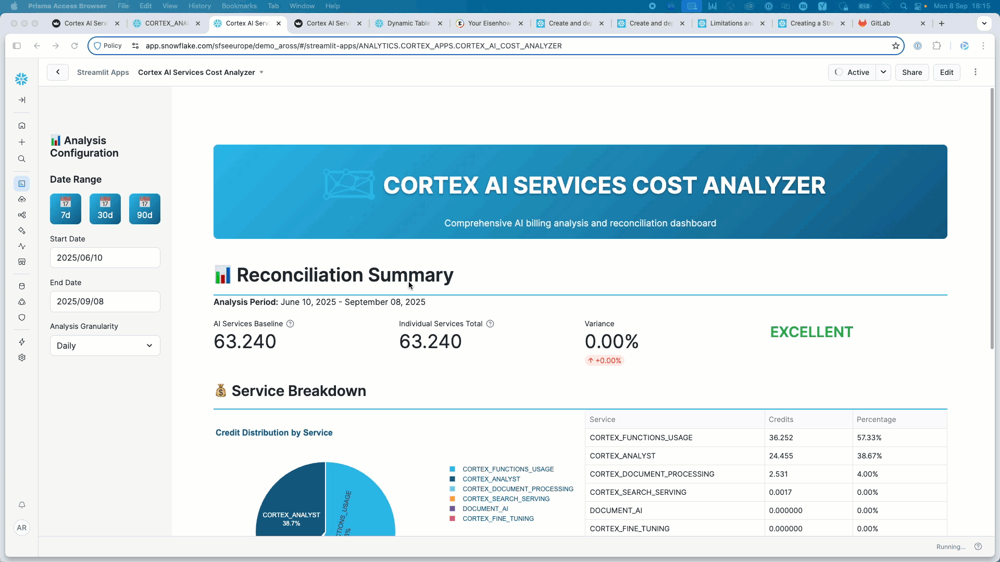

# Cortex AI Services Cost Analyzer

[](https://www.snowflake.com/)
[](https://streamlit.io/)
[](https://python.org/)

A comprehensive cost analysis and reconciliation dashboard for **Snowflake Cortex AI Services**. This application provides detailed insights into AI service consumption, billing reconciliation, and performance analytics across all Cortex AI capabilities.



## 🚀 Features

### 📊 Reconciliation Analysis
- **AI Services Baseline** vs **Individual Services** reconciliation
- Variance analysis to identify billing discrepancies
- Real-time reconciliation status monitoring
- Support for all Cortex AI service types

### 🤖 Model-Level Analysis
- Token usage and credit consumption by LLM model
- Efficiency metrics (tokens per credit)
- Model performance comparison
- Invocation statistics and patterns

### 📈 Time Series Analytics
- Daily and hourly usage trends
- Peak usage identification
- Service-specific consumption patterns
- Historical usage analysis

### 🔧 Service Breakdown
- Detailed breakdown by Cortex service type:
  - **Cortex Functions** (LLM/AI Functions)
  - **Cortex Analyst** (Business Intelligence)
  - **Document AI** (Document Processing)
  - **Search Optimization** (Vector Search)
  - **Machine Learning** (AutoML Services)

### 📋 Data Export
- Raw data export in CSV and Excel formats
- Comprehensive usage reports
- Unified credit calculations across service types
- Performance-optimized data retrieval

## 🏗️ Architecture

This application follows a **monorepo structure** with shared components:

```
cortex-consumption/
├── streamlit_app.py              # Main Streamlit application
├── snowflake.yml                 # Snowflake CLI configuration
├── environment.yml               # Conda environment
├── setup.sql                     # Database setup script
├── sql/                          # SQL analysis scripts
│   └── cortex_credit_consumption_analysis.sql
├── common/                       # Shared library components
│   ├── analytics/
│   │   ├── data_layer.py         # Data access layer
│   │   └── reconciliation.py     # Business logic
│   ├── components/               # Reusable UI components
│   ├── utils/                    # Utility functions
│   │   ├── data_helpers.py
│   │   └── performance_monitor.py
│   └── assets/                   # Static assets
└── pages/                        # Additional Streamlit pages
```

## 🛠️ Prerequisites

### Snowflake Requirements
- Snowflake account with Cortex AI Services enabled
- Access to `SNOWFLAKE.ACCOUNT_USAGE` views:
  - `METERING_HISTORY`
  - `METERING_DAILY_HISTORY`
  - `QUERY_HISTORY`
  - `CORTEX_FUNCTIONS_USAGE_HISTORY`
  - `CORTEX_FUNCTIONS_QUERY_USAGE_HISTORY`
  - `CORTEX_ANALYST_USAGE_HISTORY`
  - `CORTEX_SEARCH_SERVING_USAGE_HISTORY`
  - `CORTEX_FINE_TUNING_USAGE_HISTORY`
  - `CORTEX_DOCUMENT_PROCESSING_USAGE_HISTORY`
  - `DOCUMENT_AI_USAGE_HISTORY`
- (Optional) Access to `SNOWFLAKE.ORGANIZATION_USAGE.METERING_DAILY_HISTORY` for improved reconciliation accuracy across multiple accounts.

### Required Roles/Permissions
```sql
-- Grant access to system views
GRANT IMPORTED PRIVILEGES ON DATABASE SNOWFLAKE TO ROLE <YOUR_ROLE>;

-- Database and schema access
GRANT USAGE ON DATABASE ANALYTICS TO ROLE <YOUR_ROLE>;
GRANT USAGE ON SCHEMA ANALYTICS.CORTEX_APPS TO ROLE <YOUR_ROLE>;
```

## 🚀 Quick Start

### Option 1: Deploy to Snowflake (Recommended)

1. **Install Snowflake CLI**
   ```bash
   pip install snowflake-cli-labs
   ```

2. **Configure Snowflake Connection**
   ```bash
   snow configure
   ```

3. **Setup Database Objects**
   ```bash
   snow sql -f setup.sql
   ```

4. **Deploy the Application**
   ```bash
   snow streamlit deploy
   ```

5. **Access Your App**
   - Navigate to Snowsight > Projects > Streamlit
   - Open "CORTEX_AI_COST_ANALYZER"

### Option 2: Run Locally (Development)

1. **Clone and Setup Environment**
   ```bash
   git clone <repository-url>
   cd cortex-consumption
   conda env create -f environment.yml
   conda activate cortex_cost_analyzer
   ```

2. **Configure Authentication**
   Create `~/.snowflake/config.toml`:
   ```toml
   [connections.default]
   account = "your-account"
   user = "your-username"
   private_key_path = "~/.snowflake/rsa_key.p8"
   warehouse = "COMPUTE_WH"
   database = "ANALYTICS"
   schema = "CORTEX_APPS"
   role = "SYSADMIN"
   ```

3. **Run the Application**
   ```bash
   streamlit run streamlit_app.py
   ```

## 📖 Usage Guide

### 1. Dashboard Overview
The main dashboard provides:
- **Reconciliation Summary**: Overall billing reconciliation status
- **Service Breakdown**: Credit distribution across Cortex services
- **Key Metrics**: Total credits, variance percentages, and status indicators

### 2. Analysis Configuration
Use the sidebar to configure:
- **Date Range**: Quick buttons (7d, 30d, 90d) or custom dates
- **Granularity**: Daily or hourly analysis
- **Service Filters**: Automatic inclusion of all available services

### 3. Detailed Analysis Tabs

#### Model Analysis
- View credit distribution by LLM model
- Analyze token efficiency (tokens per credit)
- Monitor model-specific usage patterns

#### Service Details
- Detailed breakdown by service type
- Service-specific insights and metadata
- Historical usage patterns

#### Time Series
- Visual trends over time
- Peak usage identification
- Service-specific trend analysis

#### Raw Data
- Export functionality for detailed analysis
- Unified credit calculations
- Performance-optimized data retrieval

### 4. Performance Debugging
Enable the debug mode to monitor:
- Query execution times
- Memory usage patterns
- Cache performance metrics
- Session state management

## 🔧 Configuration

### Snowflake CLI Configuration (`snowflake.yml`)
```yaml
definition_version: 2
entities:
  cortex_cost_analyzer:
    type: streamlit
    identifier:
      name: "CORTEX_AI_COST_ANALYZER"
      schema: "CORTEX_APPS"
      database: "ANALYTICS"
    query_warehouse: "COMPUTE_WH"
    main_file: "streamlit_app.py"
```

### Environment Configuration (`environment.yml`)
The application uses a Conda environment with dependencies:
- `streamlit` - Web application framework
- `snowflake-snowpark-python` - Snowflake connectivity
- `pandas`, `numpy` - Data processing
- `plotly` - Interactive visualizations
- `openpyxl`, `xlsxwriter` - Excel export support

## 📊 Data Sources

### Primary Tables
1. **METERING_HISTORY**: Overall AI Services baseline credits
2. **CORTEX_FUNCTIONS_USAGE_HISTORY**: LLM/AI function usage
3. **CORTEX_ANALYST_USAGE_HISTORY**: Business intelligence queries
4. **DOCUMENT_AI_USAGE_HISTORY**: Document processing usage
5. **SEARCH_OPTIMIZATION_USAGE_HISTORY**: Vector search optimization
6. **AUTOMATIC_CLUSTERING_HISTORY**: ML-based clustering services

### Data Reconciliation Logic
The application performs reconciliation by:
1. Summing all individual service credits
2. Comparing against AI_SERVICES baseline from METERING_HISTORY
3. Calculating variance percentage
4. Providing reconciliation status (EXCELLENT, GOOD, WARNING, CRITICAL)

## 🎨 Customization

### Adding New Services
To support additional Cortex services:
1. Update `SERVICE_CONFIGS` in `data_layer.py`
2. Add corresponding SQL queries
3. Update reconciliation logic in `reconciliation.py`

## 🔍 Troubleshooting

### Common Issues

1. **"No data available"**
   - Check date range (ACCOUNT_USAGE has 2-3 hour delay)
   - Verify service permissions
   - Ensure Cortex AI services are enabled

2. **Connection Issues**
   - Verify Snowflake CLI configuration
   - Check authentication credentials
   - Ensure warehouse is running

3. **Performance Issues**
   - Use shorter date ranges for large datasets
   - Enable caching (automatic in Streamlit deployment)
   - Monitor using debug mode

### Debug Mode
Enable debug mode in the sidebar to view:
- Performance metrics
- Cache hit rates
- Memory usage
- Query execution times

## 📚 Documentation

### Key Components

- **`streamlit_app.py`**: Main application entry point
- **`data_layer.py`**: Snowflake data access and caching
- **`reconciliation.py`**: Business logic for cost reconciliation
- **`performance_monitor.py`**: Performance tracking and optimization

### SQL Analysis Script
The `sql/cortex_credit_consumption_analysis.sql` file provides standalone SQL analysis that mirrors the Streamlit app functionality, useful for:
- Ad-hoc analysis
- Automated reporting
- Data validation

## 🆘 Support

For support and questions:
- Review the [Snowflake Cortex AI documentation](https://docs.snowflake.com/en/guides-overview-ai-features)
- Check the [Snowflake CLI documentation](https://docs.snowflake.com/en/developer-guide/snowflake-cli/index)
- Use the debug mode for performance troubleshooting

---
